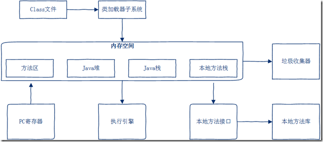
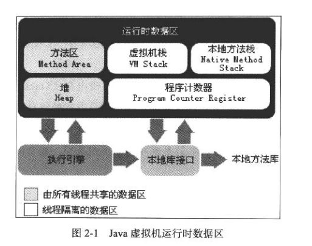
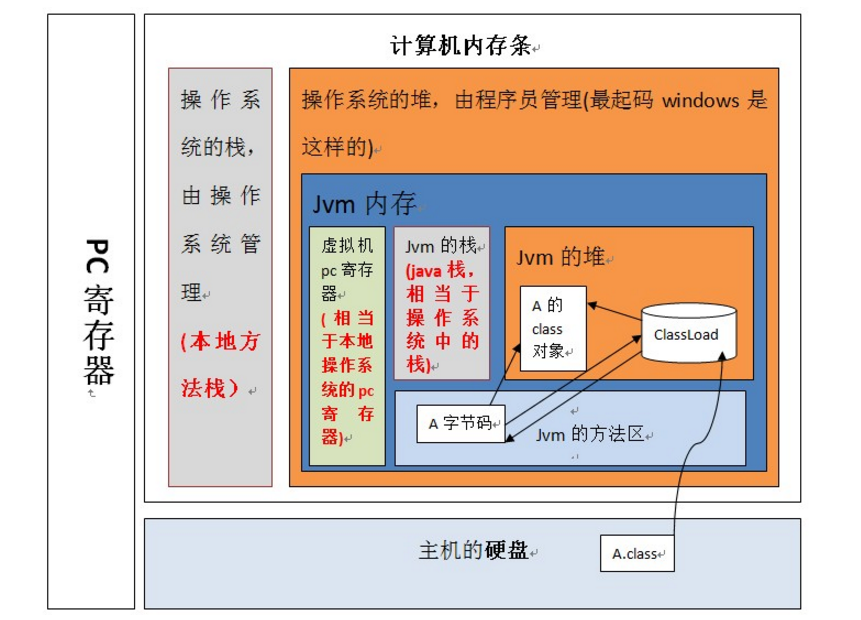
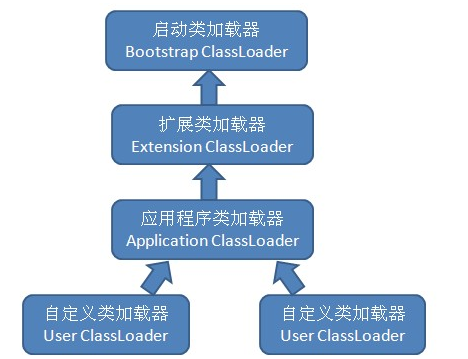
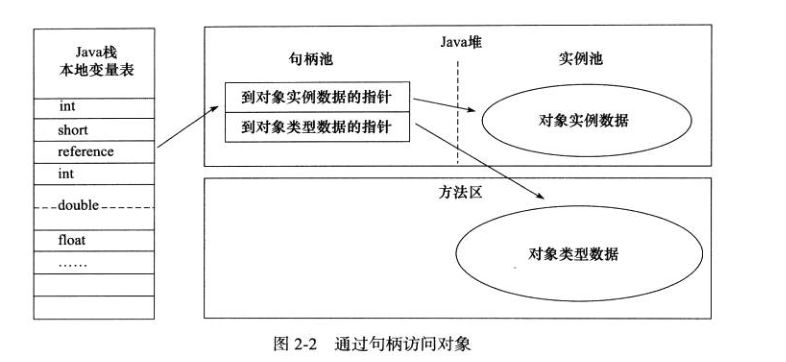
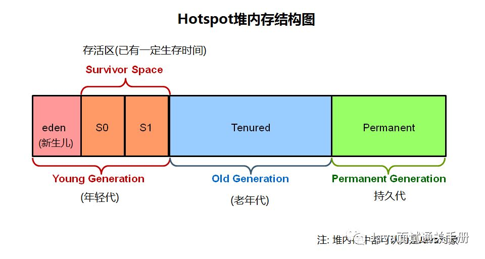

# 综述

> 般作为Java程序员在面试的时候一般会问的大多就是**Java内存区域、虚拟机垃圾算法、虚拟垃圾收集器、JVM内存管理、JVM调优、虚拟机性能检测**这些问题了。这些内容参考周的《深入理解Java虚拟机》中第二章和第三章就足够了。

面试一般就基于Hotspot。没有见过面试时提问不同虚拟机之间差别之类的问题。

先区分一个概念：

- Jmm是Java内存模型的缩写，是并发里面的概念。也就是说Java虚拟机会什么时候把缓存里的内容溢写到主内存，实现各个线程的一致读写（详见Java多线程中volatile部分内容）。

- Java虚拟机规范里面把所谓的“Jvm内存模型”称之为The Structure of the Java Virtual Machine，Java虚拟机的结构。

> # JVM基本结构

# 运行时数据区域

- #### 程序计数器

  程序计数器是来指示当前线程正在执行的JVM指令，因此程序计数器是**线程私有**的。一个JVM支持多个线程，每一个线程都要自己的程序计数器。如果线程正在执行的方法是Java方法，则程序计数器保存的是当前线程正在执行的JVM指令，如果正在执行的方法是Native方法，则保存为空（undefined)。

- #### 虚拟机栈

  虚拟机栈就是常说的栈内存，**线程私有，生命周期和线程相同**。虚拟机栈**存储栈帧**，栈帧中存放的局部变量表，方法部分返回值等。局部变量表主要存放了编译器可知的各种**数据类型、对象引用**。

- #### 本地方法栈

  本地方法栈存储着native方法的调用状态，**线程私有**。

- #### 堆

  Java虚拟机所管理的内存中最大的一块，**线程共享**，虚拟机启动时创建。**存放对象实例，几乎所有的对象实例以及数组都在这里分配内存。**

  Java堆是垃圾收集器管理的主要区域，因此也被称作**GC堆（Garbage Collected Heap）**.从垃圾回收的角度，由于现在收集器基本都采用分代垃圾收集算法，所以Java堆还可以细分为：新生代和老年代：在细致一点有：Eden空间、From Survivor、To Survivor空间等。

- #### 方法区

  别名叫做 **Non-Heap（非堆）**，**线程共享**，其主要存储着所加载的类的信息，如名称、修饰符等、类中的**静态变量**、类中定义为final类型的**常量**、类中的Field信息、类中的方法信息。

  HotSpot虚拟机中方法区也常被称为 **“永久代”**，本质上两者并**不等价**。

  - #### 运行时常量池

    运行时常量池是方法区的一部分，存放着类中固定的常量信息、方法、和field的引用信息。JVM在加载类的时候会为每一个Class分配一个独立的常量池。

    > **JDK1.7及之后版本的 JVM 已经将运行时常量池从方法区中移了出来，在 Java 堆（Heap）中开辟了一块区域存放运行时常量池。同时在 jdk 1.8中移除整个永久代，取而代之的是一个叫元空间（Metaspace）的区域**。

- ### 直接内存

  直接内存并不是虚拟机运行时数据区的一部分，也不是虚拟机规范中定义的内存区域。在NIO中被引入和频繁的使用。使用Native函数库直接分配堆外内存，然后通过一个存储在java堆中的DirectByteBuffer对象作为这块内存的引用进行操作。**避免了在Java堆和Native堆之间来回复制数据**，显著提高性能。

# 类加载机制

虚拟机把描述类的数据从class文件加载到内存，并对数据进行校验、转换解析和初始化。最终形成可以被虚拟机最直接使用的java类型的过程就是虚拟机的类加载机制。

## 类加载过程

类加载过程分为**加载**、**验证**、**准备**、**解析**和**初始化**这5个阶段。

- 加载

  1.  通过类型的完全限定名，产生一个代表该类型的二进制数据流。

  2.  解析这个二进制数据流为方法区内的运行时数据结构。

  3.  创建一个表示该类型的java.lang.Class类的实例，作为方法区这个类的各种数据的访问入口。

     

- 验证

  目的是**为了确保Class文件的字节流中包含的信息符合当前虚拟机的要求，并且不会危害虚拟机自身的安全**。大致上会完成4个阶段的校验工作：**文件格式、元数据、字节码、符号引用**。

- 准备

  准备阶段是正式为类变量**分配内存**并**设置类变量初始值**的阶段，这些变量所使用的内存都将在**方法区**中进行分配。（备注：这时候进行内存分配的仅包括类变量（**被static修饰的变量**），而不包括实例变量，实例变量将会在对象实例化时随着对象一起分配在Java堆中）。**初始值通常是数据类型的零值，赋值操作在初始化阶段进行**

- 解析

  解析阶段是虚拟机将常量池内的符号引用替换为直接引用的过程。

  > **符号引用(Symbolic References)：** 符号引用以一组符号来描述所引用的目标，符号可以是符合约定的任何形式的字面量，符号引用与虚拟机实现的内存布局无关，引用的目标并不一定已经加载到内存中。
  >
  > **直接引用（Direct References）:** 直接引用可以是直接指向目标的指针、相对偏移量或是一个能间接定位到目标的句柄。直接引用与虚拟机实现的内存布局相关，引用的目标必定已经在内存中存在。

- 初始化

  执行类中定义的java程序初始化代码

## 类加载器

对于任意一个类，都需要由加载它的类加载器和这个类本身一同确立其在Java虚拟机中的唯一性。如果两个类来源于同一个Class文件，只要加载它们的类加载器不同，那么这两个类就必定不相等。

- **启动类加载器（Bootstrap ClassLoader）：**

  这个类加载器负责将存放在/lib目录中的，或者被-Xbootclasspath参数所指定的路径中的，并且是虚拟机识别的（仅按照文件名识别，如rt.jar，名字不符合的类库即使放在lib目录中也不会被加载）类库加载到虚拟机内存中。

- **扩展类加载器（Extension ClassLoader）：**

  这个加载器由sun.misc.Launcher$ExtClassLoader实现，它负责加载/lib/ext目录中的，或者被java.ext.dirs系统变量所指定的路径中的所有类库，开发者可以直接使用扩展类加载器。

- **应用程序类加载器（Application ClassLoader）：**

  这个类加载器由sun.misc.Launcher$AppClassLoader实现。由于这个类加载器是ClassLoader中的getSystemClassLoader()方法的返回值，所以一般也称它为系统类加载器。它负责加载用户类路径（ClassPath）上所指定的类库，开发者可以直接使用这个类加载器，如果应用程序中没有自定义过自己的类加载器，一般情况下这个就是程序中默认的类加载器。

> ### 双亲委派模型

- **双亲委派模型的工作过程：** 如果一个类加载器收到了类加载的请求，先把这个请求委派给父类加载器去完成（所以所有的加载请求最终都应该传送到顶层的启动类加载器中），只有当父加载器反馈自己无法完成加载请求时，子加载器才会尝试自己去加载。

​	优点：使得类先天具有一个层级结构。

> #### tomcat类加载有什么不同?

//todo

[图解Tomcat类加载机制(阿里面试题)](https://www.cnblogs.com/aspirant/p/8991830.html)

[Tomcat类加载机制和JAVA类加载机制的比较](https://blog.csdn.net/dreamcatcher1314/article/details/78271251)

# 对象
## 对象创建

- **类加载检查**

  检查是否能在常量池中定位到这个类是否已加载完成，如果没有，那必须先执行相应的类加载过程。

- **分配内存**

  对象所需的内存大小在类加载完成后便可确定，为对象分配空间的任务等同于把一块确定大小的内存从Java堆中划分出来。

  > **内存分配方法**

  **分配方式**有 **“指针碰撞”** 和 **“空闲列表”** 两种，选择那种分配方式**由 Java 堆是否规整决定**，而Java堆是否规整又由所采用的垃圾收集器是否带有压缩整理功能决定。

  

  > **内存分配并发问题**

  通常来讲，虚拟机采用两种方式来保证线程安全：

  - **CAS+失败重试：** CAS是乐观锁的一种实现方式。所谓乐观锁就是，每次不加锁而是假设没有冲突而去完成某项操作，如果因为冲突失败就重试，直到成功为止。**虚拟机采用 CAS 配上失败重试的方式保证更新操作的原子性。**
  - **TLAB：** 为每一个线程预先在Eden区（年轻代）分配一块儿内存，JVM在给线程中的对象分配内存时，首先在TLAB分配，当对象大于TLAB中的剩余内存或TLAB的内存已用尽时，再采用上述的CAS进行内存分配

- 初始化零值

  将分配到的内存空间都初始化为零值

- 设置对象头

  **虚拟机要对对象进行必要的设置**。

  例如这个对象是那个类的实例、如何才能找到类的元数据信息、对象的哈希吗、对象的GC分代年龄等信息。 这些信息存放在对象头中。

- 执行 init 方法

  执行 new 指令之后会接着执行 `<init>` 方法，把对象按照程序员的意愿进行初始化，这样一个真正可用的对象才算完全产生出来。

## 对象的内存布局

在Hotspot虚拟机中，对象在内存中的布局可以分为3快区域：**对象头**、**实例数据**和**对齐填充**。

- **Hotspot虚拟机的对象头包括两部分信息**，**第一部分用于存储对象自身的自身运行时数据**（哈希吗、GC分代年龄、锁状态标志等等），**另一部分是类型指针**，即对象指向它的类元数据的指针，虚拟机通过这个指针来确定这个对象是那个类的实例。
- **实例数据部分是对象真正存储的有效信息**，也是在程序中所定义的各种类型的字段内容。
- **对齐填充部分不是必然存在的，也没有什么特别的含义，仅仅起占位作用。**

## 对象的访问定位

对象的访问方式有虚拟机实现而定，目前主流的访问方式有**使用句柄**和**直接指针**两种

- **句柄：** 如果使用句柄的话，那么Java堆中将会划分出一块内存来作为句柄池，reference 中存储的就是对象的句柄地址，而句柄中包含了对象实例数据与类型数据各自的具体地址信息

- **直接指针：** 如果使用直接指针访问，那么Java堆对像的布局中就必须考虑如何放置访问类型数据的相关信息，reference 中存储的直接就是对象的地址。

**这两种对象访问方式各有优势。使用句柄来访问的最大好处是reference中存储的是稳定的句柄地址，在对象被移动时只会改变句柄中的实例数据指针，而reference本身不需要修改。使用直接指针访问方式最大的好处就是速度快，它节省了一次指针定位的时间开销。**

# GC

## 对象死亡

1. 引用计数法

   给对象中添加一个引用计数器，每当有一个地方引用它，计数器就加1；当引用失效，计数器就减1；任何时候计数器为0的对象就是不可能再被使用的。

   这个方法实现简单，效率高，但是目前主流的虚拟机中并没有选择这个算法来管理内存，其最主要的原因是它很难解决对象之间相互循环引用的问题。

2. 可达性分析算法

   这个算法的基本思想就是通过一系列的称为 **“GC Roots”** 的对象作为起点，从这些节点开始向下搜索，节点所走过的路径称为引用链，当一个对象到GC Roots没有任何引用链相连的话，则证明此对象是不可用的。

   > 一个对象可以属于多个root，GC root有几下种：
   >
   > Class - 由系统类加载器(system class  loader)加载的对象，这些类是不能够被回收的，他们可以以静态字段的方式保存持有其它对象。我们需要注意的一点就是，通过用户自定义的类加载器加载的类，除非相应的java.lang.Class实例以其它的某种（或多种）方式成为roots，否则它们并不是roots。
   >
   > Thread - 活着的线程
   >
   > Stack Local - Java方法的local变量或参数
   >
   > JNI Local - JNI方法的local变量或参数
   >
   > JNI Global - 全局JNI引用
   >
   > Monitor Used - 用于同步的监控对象
   >
   > Held by JVM -  用于JVM特殊目的由GC保留的对象，但实际上这个与JVM的实现是有关的。可能已知的一些类型是：系统类加载器、一些JVM知道的重要的异常类、一些用于处理异常的预分配对象以及一些自定义的类加载器等。然而，JVM并没有为这些对象提供其它的信息，因此需要去确定哪些是属于"JVM持有"的了。
   >
   > /------------------------------------------------------------------------------------------------------
   >
   > 在Java语言里，可作为GC Roots对象的包括如下几种： 
   >  a.虚拟机栈(栈桢中的本地变量表)中的引用的对象 
   >  b.方法区中的类静态属性引用的对象 
   >  c.方法区中的常量引用的对象
   >  d.本地方法栈中JNI的引用的对象

## 垃圾收集算法

> ### 标记-清除算法

- 算法分为“标记”和“清除”阶段：首先标记出所有需要回收的对象，在标记完成后统一回收所有被标记的对象
- 它是最基础的收集算法，会带来两个明显的问题；1：效率问题和。2：空间问题（标记清除后会产生大量不连续的碎片）

> ### 复制算法

- 将内存分为大小相同的两块，每次使用其中的一块。当这一块的内存使用完后，就将还存活的对象复制到另一块去，然后再把使用的空间一次清理掉。这样就使每次的内存回收都是对内存区间的一半进行回收。
- 缺点是内存利用率低，只能使用一半的内存。同时进行复制也是需要时间的。

> ### 标记-整理算法

- 根据**老年代**的特点特出的一种标记算法，标记过程仍然与“标记-清除”算法一样，但后续步骤不是直接对可回收对象回收，而是让所有存活的对象向一段移动，然后直接清理掉端边界以外的内存。

> ### 分代收集算法

- 当前虚拟机的垃圾收集都采用分代收集算法，这种算法没有什么新的思想，只是根据对象存活周期的不同将内存分为几块。一般将java堆分为新生代和老年代，这样我们就可以根据各个年代的特点选择合适的垃圾收集算法。

- 比如在新生代中，每次收集都会有大量对象死去，所以可以选择复制算法，只需要付出少量对象的复制成本就可以完成每次垃圾收集。而老年代的对象存活几率是比较高的所以我们可以选择“标记-清理”或“标记-整理”算法进行垃圾收集。

## 垃圾收集器

>### Serial收集器

- Serial（串行）收集器收集器是最基本、历史最悠久的垃圾收集器了。
- **单线程**。
- 它在进行垃圾收集工作的时候必须暂停其他所有的工作线程
- 新生代，使用**复制算法**。

​	优缺点：它**简单而高效（与其他收集器的单线程相比）**。Serial收集器由于没有线程交互的开销，自然可以获得很高的单线程收集效率。Serial收集器对于运行在Client模式下的虚拟机来说是个不错的选择。

> ### ParNew收集器

- **Serial收集器的多线程版本**，**除了使用多线程进行垃圾收集外，其余行为（控制参数、收集算法、回收策略等等）和Serial收集器完全一样。**
- 新生代使用复制算法

> ### Parallel Scavenge收集器

- 新生代、多线程、使用复制算法

​	优点：**高吞吐量**，但是会有长时间的停顿，适合批处理。

> ### Serial Old收集器

- **Serial收集器的老年代版本**，单线程，使用**标记-整理**算法。
- 它主要有两大用途：一种用途是在JDK1.5以及以前的版本中与Parallel Scavenge收集器搭配使用，另一种用途是作为CMS收集器的后备方案。

> ### Parallel Old收集器

- **Parallel Scavenge收集器的老年代版本**。使用多线程和“标记-整理”算法。
- 在注重吞吐量以及CPU资源的场合，都可以优先考虑 Parallel Scavenge收集器和Parallel Old收集器。

> ### CMS收集器（Concurrent Mark Sweep）

- 使用**标记-清除**算法。

- 过程分为四个步骤

  - **初始标记：** 暂停所有的其他线程，并记录下直接与root相连的对象，速度很快 ；
  - **并发标记：** 同时开启GC和用户线程，用一个闭包结构去记录可达对象。但在这个阶段结束，这个闭包结构并不能保证包含当前所有的可达对象。因为用户线程可能会不断的更新引用域，所以GC线程无法保证可达性分析的实时性。所以这个算法里会跟踪记录这些发生引用更新的地方。
  - **重新标记：** 重新标记阶段就是为了修正并发标记期间因为用户程序继续运行而导致标记产生变动的那一部分对象的标记记录，这个阶段的停顿时间一般会比初始标记阶段的时间稍长，远远比并发标记阶段时间短
  - **并发清除：** 开启用户线程，同时GC线程开始对为标记的区域做清扫。

优缺点：

- **对CPU资源敏感；**

- **无法处理浮动垃圾；**

- **它使用的回收算法“标记-清除”算法会导致收集结束时会有大量空间碎片产生。**

  

> ### G1收集器

  **G1 (Garbage-First)是一款面向服务器的垃圾收集器,主要针对配备多颗处理器及大容量内存的机器. 以极高概率满足GC停顿时间要求的同时,还具备高吞吐量性能特征.**

被视为JDK1.7中HotSpot虚拟机的一个重要进化特征。它具备一下特点：

- **并行与并发**：G1能充分利用CPU、多核环境下的硬件优势，使用多个CPU（CPU或者CPU核心）来缩短stop-The-World停顿时间。部分其他收集器原本需要停顿Java线程执行的GC动作，G1收集器仍然可以通过并发的方式让java程序继续执行。
- **分代收集**：虽然G1可以不需要其他收集器配合就能独立管理整个GC堆，但是还是保留了分代的概念。
- **空间整合**：与CMS的“标记--清理”算法不同，G1从整体来看是基于“标记整理”算法实现的收集器；从局部上来看是基于“复制”算法实现的。
- **可预测的停顿**：这是G1相对于CMS的另一个大优势，降低停顿时间是G1和ＣＭＳ共同的关注点，但Ｇ１除了追求低停顿外，还能建立可预测的停顿时间模型，能让使用者明确指定在一个长度为M毫秒的时间片段内。

**G1收集器在后台维护了一个优先列表，每次根据允许的收集时间，优先选择回收价值最大的Region(这也就是它的名字Garbage-First的由来)**。这种使用Region划分内存空间以及有优先级的区域回收方式，保证了GF收集器在有限时间内可以尽可能高的收集效率（把内存化整为零）。

# 内存分配与回收策略

- ## 对象优先在Eden区分配

  大多数情况下，对象在新生代中Eden区分配。当Eden区没有足够空间进行分配时，虚拟机将发起一次Minor GC。

> **Minor Gc和Full GC 有什么不同呢？**

- **新生代GC（Minor GC）**:指发生新生代的的垃圾收集动作，Minor GC非常频繁，回收速度一般也比较快。
- **老年代GC（Major GC/Full GC）**:指发生在老年代的GC，出现了Major GC经常会伴随至少一次的Minor GC（并非绝对），Major GC的 速度一般会比Minor GC的慢10倍以上。

- ## 大对象直接进入老年代

  大对象就是需要大量连续内存空间的对象（比如：字符串、数组）。

- ## 长期存活的对象将进入老年代

  为了做到这一点，虚拟机给每个对象一个对象年龄（Age）计数器。

- ###  动态对象年龄判定

  为了更好的适应不同程序的内存情况，虚拟机不是永远要求对象年龄必须达到了某个值才能进入老年代，如果Survivor 空间中相同年龄所有对象大小的总和大于Survivor空间的一半，年龄大于或等于该年龄的对象就可以直接进入老年代，无需达到要求的年龄。

# 机性能监控

## JDK监控和故障处理工具

- **jps**：JVM Process Status Tool ,显示指定系统内所有的HotSpot虚拟机进程
- **jstat**: JVM Statistics Monitoring Tool ,用于收集HotSpot虚拟机各方面的运行数据。
- **jinfo**: Configuration Info forJava,显示虚拟机配置信息
- **jmap**: Memory Map for Java，生成虚拟机的内存转储快照（heapdump文件）
- **jhat**: JVM Heap Dump Browser ,用于分析heapdump文件，它会建立一个HTTP/HTML服务器，让用户可以在浏览器上查看分析结果
- **jstack**: Stack Trace forJava，显示虚拟机的线程快照

## JDK可视化工具

- **JConsole**
- **VisualVM**
- **eclipse memory analyer**

# JVM调优

首先需要注意的是在对JVM内存调优的时候不能只看操作系统级别Java进程所占用的内存，这个数值不能准确的反应堆内存的真实占用情况，因为GC过后这个值是不会变化的，因此内存调优的时候要更多地使用JDK提供的内存查看工具，比如**JConsole**和**Java VisualVM**。

对JVM内存的系统级的调优主要的目的是**减少GC的频率和Full GC的次数**，过多的GC和Full GC是会占用很多的系统资源（主要是CPU），影响系统的吞吐量。特别要关注Full GC，因为它会对整个堆进行整理，导致Full GC一般由于以下几种情况：

1. 旧生代空间不足

   调优时尽量让对象在新生代GC时被回收、让对象在新生代多存活一段时间和不要创建过大的对象及数组避免直接在旧生代创建对象 。

2. Pemanet Generation空间不足。

3. System.gc()被显示调用。

   垃圾回收不要手动触发，尽量依靠JVM自身的机制 

1. 堆大小设置

   - 检查堆大小设置是否合理

   - 检查新生代老年代大小设置

   - 检查新生代中eden与survivor比例

     > 请注意，jvm调优，调的是稳定，并不能带给你性能的大幅提升。服务稳定的重要性就不用多说了，保证服务的稳定，gc永远会是[Java](http://lib.csdn.net/base/java)程序员需要考虑的不稳定因素之一。复杂和高并发下的服务，必须保证每次gc不会出现性能下降，各种性能指标不会出现波动，gc回收规律而且干净，找到合适的jvm设置。详细了解jvm的话请看神书《深入理解java虚拟机》。
     >
     > 说些题外话，面试发现，jvm调优很多人都没有经验，有人甚至怀疑这东西真正是否有用，有的公司统一jvm的设置贯穿所有服务。其实只是没碰到生产条件复杂的情况而已.
     >
     > 举个简单例子：我曾经的公司，碰到过服务运行超过14h直接死机的问题，头天下午压测，第二天上午服务自动重启了，按照当时习惯，新服务需要压力测试满12h，原则上我的服务通过测试，由于测试环境复杂，所有开发都可以登陆而且脚本很多，qa认为可能是有脚本误杀了，但是当时离上线deadline时间还早，于是决定再压力一次，成功复现，最后查看jvm发现每次fullgc之后o区总是会多一点，jmap打印内存栈发现char对象使用逐渐增大，最后撑满内存，最后定位到调用JNI发生内存泄露，解决了这个问题。这只是简单的一次，在那家公司，由于服务偏算法而且流量很高，碰到过很多这种问题。
     >
     > 还有一次，压力测试loadrunner图像显示每隔一段时间的点上响应时间立刻下降，过2s又恢复正常，规律性很强，通过jstat发现频繁生成大对象直接进入老年代，老年代很快撑大触发full gc回收，回收时间过长造成服务暂停明显，立刻反应到压测的响应上。解决的办法是调大年轻代，让大对象可以在年轻代触发yong gc，调整大对象在年轻代的回收频次，尽可能保证大对象在年轻代回收，减小老年代缩短回收时间，服务果然稳定下来。当时这么调整下来会有一点性能损失，基本可以忽略不计，但是提升了服务的稳定性，这才是这次jvm调优最重要的。

调优手段主要是通过控制堆内存的各个部分的比例和GC策略来实现，各部分比例不良设置会导致不良后果

1. 新生代设置过小

   一是新生代GC次数非常频繁，增大系统消耗；二是导致大对象直接进入旧生代，占据了旧生代剩余空间，诱发Full GC

2. 新生代设置过大

  一是新生代设置过大会导致旧生代过小（堆总量一定），从而诱发Full GC；二是新生代GC耗时大幅度增加

  一般说来**新生代占整个堆1/3**比较合适

3. Survivor设置过小

  导致对象从eden直接到达旧生代，降低了在新生代的存活时间

4. Survivor设置过大

  导致eden过小，增加了GC频率

  另外，通过-XX:MaxTenuringThreshold=n来控制新生代存活时间，尽量让对象在新生代被回收

**常见问题**

> #### 如何优化gc参数？

GC优化的最根本原因是啥？垃圾收集器的工作就是清除Java创建的对象，垃圾收集器需要清理的对象数量以及要执行的GC数量均取决于已创建的对象数量。因此，为了使你的系统在GC上表现良好，首先需要减少创建对象的数量。

**GC优化的两个目的：**

1. **将进入老年代的对象数量降到最低**

   除了可以在JDK 7及更高版本中使用的G1收集器以外，其他分代GC都是由Oracle 
   JVM提供的。关于分代GC，就是对象在Eden区被创建，随后被转移到Survivor区，在此之后剩余的对象会被转入老年代。也有一些对象由于占用内存过大，在Eden区被创建后会直接被传入老年代。老年代GC相对来说会比新生代GC更耗时，因此，减少进入老年代的对象数量可以显著降低Full
   GC的频率。你可能会以为减少进入老年代的对象数量意味着把它们留在新生代，事实正好相反，新生代内存的大小是可以调节的。

2. **减少Full GC的执行时间**

   Full GC的执行时间比Minor GC要长很多，因此，如果在Full GC上花费过多的时间（超过1s），将可能出现超时错误。

   - 如果**通过减小老年代内存来减少Full GC时间**，可能会引起`OutOfMemoryError`或者导致Full GC的频率升高。
   - 另外，如果**通过增加老年代内存来降低Full GC的频率**，Full GC的时间可能因此增加。

   因此，**你需要把老年代的大小设置成一个“合适”的值**。

**表1：GC优化需要考虑的JVM参数**

| **类型**       | **参数**            | **描述**                   |
| -------------- | ------------------- | -------------------------- |
| 堆内存大小     | `-Xms`              | 启动JVM时堆内存的大小      |
|                | `-Xmx`              | 堆内存最大限制             |
| 新生代空间大小 | `-XX:NewRatio`      | 新生代和老年代的内存比     |
|                | `-XX:NewSize`       | 新生代内存大小             |
|                | `-XX:SurvivorRatio` | Eden区和Survivor区的内存比 |

**CG优化的过程**

1. 监控GC从而检查系统中运行的GC的各种状态。

2. 分析监控结果后决定是否需要优化GC。如果分析结果显示运行GC的时间只有0.1-0.3秒，那么就不需要把时间浪费在GC优化上，但如果运行GC的时间达到1-3秒，甚至大于10秒，那么GC优化将是很有必要的。

   但是，如果你已经分配了大约10GB内存给Java，并且这些内存无法省下，那么就无法进行GC优化了。在进行GC优化之前，你需要考虑为什么你需要分配这么大的内存空间，如果你分配了1GB或2GB大小的内存并且出现了`OutOfMemoryError`，那你就应该执行**heap dump**来消除导致异常的原因。

3. 分析结果、设置GC类型、内存大小。

[Java经典面试题（其三）——JVM原理和调优](https://blog.csdn.net/sun1021873926/article/details/78002118) 

[JVM调优总结(这个总结得比较全面)](https://blog.csdn.net/wuzhilon88/article/details/49201891)

[压力测试分析](https://www.cnblogs.com/Darrenblog/p/7076691.html)

[虚拟机性能监控和故障处理工具](https://mp.weixin.qq.com/s?__biz=MzU4NDQ4MzU5OA==&mid=2247483922&idx=1&sn=0695ff4c2700ccebb8fbc39011866bd8&chksm=fd985473caefdd6583eb42dbbc7f01918dc6827c808292bb74a5b6333e3d526c097c9351e694#rd)

[深入理解虚拟机之垃圾回收](https://mp.weixin.qq.com/s?__biz=MzU4NDQ4MzU5OA==&mid=2247483914&idx=1&sn=9aa157d4a1570962c39783cdeec7e539&chksm=fd98546bcaefdd7d9f61cd356e5584e56b64e234c3a403ed93cb6d4dde07a505e3000fd0c427#rd)

[深入理解虚拟机之虚拟机类加载机制](https://mp.weixin.qq.com/s?__biz=MzU4NDQ4MzU5OA==&mid=2247483934&idx=1&sn=f247f9bee4e240f5e7fac25659da3bff&chksm=fd98547fcaefdd6996e1a7046e03f29df9308bdf82ceeffd111112766ffd3187892700f64b40#rd)

[可能是把Java内存区域讲的最清楚的一篇文章](https://mp.weixin.qq.com/s?__biz=MzU4NDQ4MzU5OA==&mid=2247484303&idx=1&sn=af0fd436cef755463f59ee4dd0720cbd&chksm=fd9855eecaefdcf8d94ac581cfda4e16c8a730bda60c3b50bc55c124b92f23b6217f7f8e58d5&token=506869459&lang=zh_CN#rd)

[一次JVM FullGC的背后，竟隐藏着惊心动魄的线上生产事故！【石杉的架构笔记】](https://juejin.im/post/5c1a448a6fb9a04a0f652134)

[JVM的基本结构](https://www.cnblogs.com/wade-luffy/p/5752893.html)

[jvm系列(十):如何优化Java GC「译」](https://www.cnblogs.com/ityouknow/p/7653129.html)

# 进程和线程、协程的区别

> #### 概念

- 进程

  进程是具有一定独立功能的程序关于某个数据集合上的一次运行活动，进程是系统进行资源分配和调度的一个独立单位。每个进程都有自己的独立内存空间，不同进程通过进程间通信来通信。由于进程比较重量，占据独立的内存，所以上下文进程间的切换开销（栈、寄存器、虚拟内存、文件句柄等）比较大，但相对比较稳定安全。

- 线程

  线程是进程的一个实体，是CPU调度和分派的基本单位，它是比进程更小的能独立运行的基本单位。线程自己基本上不拥有系统资源，只拥有一点在运行中必不可少的资源(如程序计数器,一组寄存器和栈)，但是它可与同属一个进程的其他的线程共享进程所拥有的全部资源。线程间通信主要通过共享内存，上下文切换很快，资源开销较少，但相比进程不够稳定容易丢失数据。

- 协程

  Coroutine是编译器级的，Process和Thread是操作系统级的。**协程是一种用户态的轻量级线程，**协程的调度完全由用户控制。协程拥有自己的寄存器上下文和栈。协程调度切换时，将寄存器上下文和栈保存到其他地方，在切回来的时候，恢复先前保存的寄存器上下文和栈，直接操作栈则基本没有内核切换的开销，可以不加锁的访问全局变量，所以上下文的切换非常快。

- 管程

  这是操作系统里的概念。 管程可以看做一个软件模块，它是将共享的变量和对于这些共享变量的操作封装起来，形成一个具有一定接口的功能模块，进程可以调用管程来实现进程级别的并发控制。

>  #### 协程多与线程进行比较

1. 一个线程可以多个协程，一个进程也可以单独拥有多个协程，这样python中则能使用多核CPU。

2. 线程进程都是同步机制，而协程则是异步

3.  协程能保留上一次调用时的状态，每次过程重入时，就相当于进入上一次调用的状态

 

[Goroutine（协程）为何能处理大并发？](http://blog.51cto.com/yuhongchun/2059574)

[进程和线程、协程的区别](https://www.cnblogs.com/lxmhhy/p/6041001.html)

# 面试题

> #### 类的实例化顺序

**比如父类静态数据，构造函数，字段，子类静态数据，构造函数，字段，他们的执行顺序**

答：先静态、先父后子。
先静态：父静态 > 子静态
优先级：父类 > 子类 静态代码块 > 非静态代码块 > 构造函数
一个类的实例化过程：
1. 父类中的static代码块，当前类的static
2. 顺序执行父类的普通代码块
3. 父类的构造函数
4. 子类普通代码块
5. 子类（当前类）的构造函数，按顺序执行。
6. 子类方法的执行

> #### Java 8的内存分代改进

从永久代到元空间，在小范围自动扩展永生代避免溢出

> #### jvm中一次完整的GC流程（从ygc到fgc）是怎样的，重点讲讲对象如何晋升到老年代等

答：对象优先在新生代区中分配，若没有足够空间，Minor GC； 
大对象（需要大量连续内存空间）直接进入老年态；长期存活的对象进入老年态。如果对象在新生代出生并经过第一次MGC后仍然存活，年龄+1，若年龄超过一定限制（15），则被晋升到老年态。

> #### 你知道哪几种垃圾收集器，各自的优缺点，重点讲下cms，g1

|      |                                      |
| ---- | ------------------------------------ |
| G1   | 用于大堆区域。堆内存分割，并发回收   |
| CMS  | 多线程扫描，标记需要回收的实例，清除 |
|      |                                      |

CMS收集器：一款以获取最短回收停顿时间为目标的收集器，是基于“标记-清除”算法实现的，分为4个步骤：初始标记、并发标记、重新标记、并发清除。 

G1收集器：面向服务端应用的垃圾收集器，过程：初始标记；并发标记；最终标记；筛选回收。整体上看是“标记-整理”，局部看是“复制”，不会产生内存碎片。 

> ####    Eden和Survivor的比例分配

默认比例8:1

> #### 可以使用哪些参数来对JVM和GC进行调优？

为面试准备了解几个是很好的。

 -XX:-UseConcMarkSweepGC: 对老年代使用CMS收集器
 -XX:-UseParallelGC: 对新生代使用 Parallel GC
 -XX:-UseParallelOldGC: 在老年代和新生代都使用 Parallel GC
 -XX:-HeapDumpOnOutOfMemoryError: 当应用发生OOM时创建一个线程转储（dump）。对诊断非常有用。
 -XX:-PrintGCDetails: 打印GC的详细日志
 -Xms512m: 设置初始堆大小为 512m
 -Xmx1024m: 设置最大堆大小为 1024m
 -XX:NewSize 和 -XX:MaxNewSize: 指定新生代的默认和最大空间。
 -XX:NewRatio=3: 设置新生代和老年代大小的比例为 1:3
 -XX:SurvivorRatio=10: 设置 Eden space 和 Survivor space 的比例

- JVM方法区存储内容 是否会动态扩展 是否会出现内存溢出 出现的原因有哪些。

- 为什么jdk8用metaspace数据结构用来替代perm？

- 简单谈谈堆外内存以及你的理解和认识。

- JVM的内存模型的理解，threadlocal使用场景及注意事项？

- JVM老年代和新生代的比例？

- jstack,jmap,jutil分别的意义？如何线上排查JVM的相关问题？

- Java虚拟机中，数据类型可以分为哪几类？

- 为什么要把堆和栈区分出来呢？栈中不是也可以存储数据吗？

- 在Java中，什么是是栈的起始点，同是也是程序的起始点？

- 为什么不把基本类型放堆中呢？

- Java中的参数传递时传值呢？还是传引用？

- Java中有没有指针的概念？

- Java中，栈的大小通过什么参数来设置？

- 一个空Object对象的占多大空间？

- 对象引用类型分为哪几类？

- 如何解决同时存在的对象创建和对象回收问题？

- 讲一讲内存分代及生命周期。

- 如何选择合适的垃圾收集算法？

- JVM中最大堆大小有没有限制？

- 堆大小通过什么参数设置？

