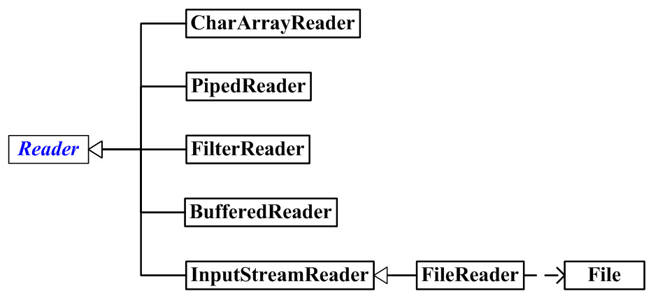
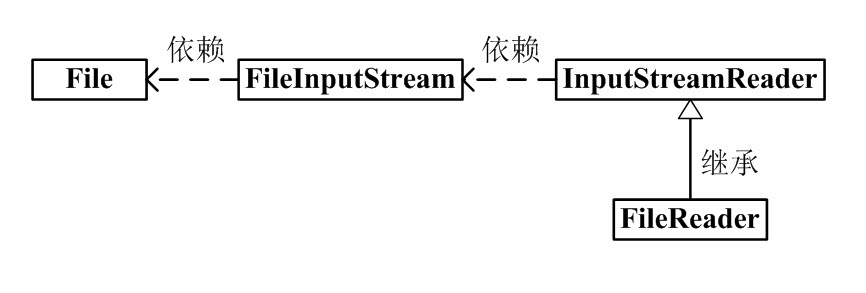
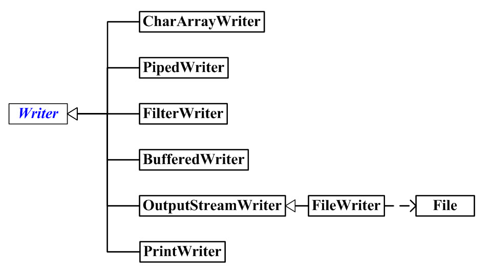
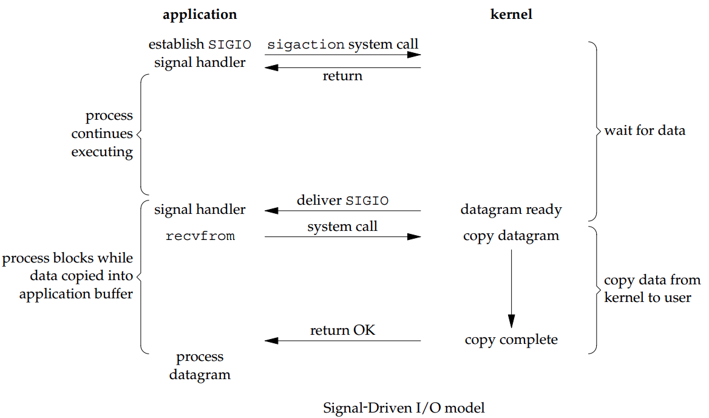

# 综述

java的基本原理，记录面试时容易考的。记录平时容易混淆的。


# 注解

## 原理

//todo


## 如何自定义注解

//todo


# Java IO

## 输入输出流

在java io的中，我们经常会提到“输入流”、“输出流”等概念。所谓**“流”，就是一种抽象的数据的总称，它的本质是能够进行传输。**

1. 按照“流”的数据流向，可以将其化分为：**输入流**和**输出流**。
2. 按照“流”中处理数据的单位，可以将其区分为：**字节流**和**字符流**。在java中，字节是占1个Byte，即8位；而字符是占2个Byte，即16位。而且，需要的是，java的字节是有符号类型，而字符是无符号类型！


### 以字节为单位的输入流


1. InputStream 是以字节为单位的输入流的超类。InputStream提供了read()接口从输入流中读取字节数据。
2. ByteArrayInputStream 是字节数组输入流。它包含一个内部缓冲区，该缓冲区包含从流中读取的字节；通俗点说，它的内部缓冲区就是一个字节数组，而ByteArrayInputStream本质就是通过**字节数组**来实现的。
3. PipedInputStream 是管道输入流，它和PipedOutputStream一起使用，能实现多线程间的管道通信。
4. FilterInputStream 是过滤输入流。它是DataInputStream和BufferedInputStream的超类。
5. DataInputStream 是数据输入流。它是用来装饰其它输入流，它“允许应用程序以与机器无关方式从底层输入流中读取基本 Java 数据类型”。
6. BufferedInputStream 是缓冲输入流。它的作用是为另一个输入流添加缓冲功能。
7. File 是“文件”和“目录路径名”的抽象表示形式。关于File，注意两点：
        a), File不仅仅只是表示文件，它也可以表示目录！
        b), File虽然在io保重定义，但是它的超类是Object，而不是InputStream。
8. FileDescriptor 是“文件描述符”。它可以被用来表示开放文件、开放套接字等。
9. FileInputStream 是文件输入流。它通常用于对文件进行读取操作。
10. ObjectInputStream 是对象输入流。它和ObjectOutputStream一起，用来提供对“基本数据或对象”的持久存储。


### 以字节为单位的输出流


1. OutputStream 是以字节为单位的输出流的超类。OutputStream提供了write()接口从输出流中读取字节数据。

2. ByteArrayOutputStream 是字节数组输出流。写入ByteArrayOutputStream的数据被写入一个 byte 
   数组。缓冲区会随着数据的不断写入而**自动增长**。可使用 toByteArray() 和 toString() 获取数据。

3. PipedOutputStream 是管道输出流，它和PipedInputStream一起使用，能实现多线程间的管道通信。

4. FilterOutputStream 是过滤输出流。它是DataOutputStream，BufferedOutputStream和PrintStream的超类。

5. DataOutputStream 是数据输出流。它是用来**装饰**其它输出流，它“允许应用程序以与机器无关方式向底层写入基本 Java 数据类型”。

6. BufferedOutputStream 是缓冲输出流。它的作用是为另一个输出流添加缓冲功能。

7. PrintStream 是打印输出流。它是用来装饰其它输出流，能为其他输出流添加了功能，使它们能够方便地打印各种数据值表示形式。

8. FileOutputStream 是文件输出流。它通常用于向文件进行写入操作。

9. ObjectOutputStream 是对象输出流。它和ObjectInputStream一起，用来提供对“基本数据或对象”的持久存储。


### 以字符为单位的输入流



1. Reader 是以字符为单位的输入流的超类。它提供了read()接口来取字符数据。
2. CharArrayReader 是字符数组输入流。它用于读取字符数组，它继承于Reader。操作的数据是以字符为单位！
3. PipedReader 是字符类型的管道输入流。它和PipedWriter一起是可以通过管道进行线程间的通讯。在使用管道通信时，必须将PipedWriter和PipedReader配套使用。
4. FilterReader 是字符类型的过滤输入流。
5. BufferedReader 是字符缓冲输入流。它的作用是为另一个输入流添加缓冲功能。
6. InputStreamReader 是字节转字符的输入流。它是字节流通向字符流的桥梁：它使用指定的 charset 读取字节并将其解码为字符。
7. FileReader 是字符类型的文件输入流。它通常用于对文件进行读取操作。


**字节流与字符流可以互相转化**



1. FileReader继承于InputStreamReader，而InputStreamReader依赖于InputStream。具体表现在InputStreamReader的构造函数是以InputStream为参数。我们传入InputStream，在InputStreamReader内部通过转码，将字节转换成字符。
2. FileWriter继承于OutputStreamWriter，而OutputStreamWriter依赖于OutputStream。具体表现在OutputStreamWriter的构造函数是以OutputStream为参数。我们传入OutputStream，在OutputStreamWriter内部通过转码，将字节转换成字符。


### 以字符为单位的输出流



1. Writer 是以字符为单位的输出流的超类。它提供了write()接口往其中写入数据。
2. CharArrayWriter 是字符数组输出流。它用于读取字符数组，它继承于Writer。操作的数据是以字符为单位！
3. PipedWriter 是字符类型的管道输出流。它和PipedReader一起是可以通过管道进行线程间的通讯。在使用管道通信时，必须将PipedWriter和PipedWriter配套使用。
4. FilterWriter 是字符类型的过滤输出流。
5. BufferedWriter 是字符缓冲输出流。它的作用是为另一个输出流添加缓冲功能。
6. OutputStreamWriter 是字节转字符的输出流。它是字节流通向字符流的桥梁：它使用指定的 charset 将字节转换为字符并写入。
7. FileWriter 是字符类型的文件输出流。它通常用于对文件进行读取操作。
8. PrintWriter 是字符类型的打印输出流。它是用来装饰其它输出流，能为其他输出流添加了功能，使它们能够方便地打印各种数据值表示形式。


> #### 字节流与字符流的区别

- 字节流在操作时本身不会用到缓冲区（内存），是文件本身直接操作的
- 而字符流在操作时使用了缓冲区，通过缓冲区再操作文


[java io系列01之 "目录"](https://www.cnblogs.com/skywang12345/p/io_01.html)


## IO模型 

	在读取文件时会涉及I/O操作，在发送和接收网络数据时也会涉及IO操作。所有涉及到I/O的操作都要直接或者间接的经过内核程序。网络传输数据，首先是内核先接收到数据，然后内核将数据拷贝到用户态中供应用进程使用。这里使用网络I/O进行演示。


**概念解释**

- 阻塞与非阻塞指的是当不能进行读写（网卡满时的写/网卡空的时候的读）的时候，I/O 操作立即返回还是阻塞；**阻塞/非阻塞关注的是程序（线程）等待消息通知时的状态**


- 同步异步指的是，当数据已经ready的时候，读写操作是同步读还是异步读。**同步与异步主要是从消息通知机制角度来说的。**`异步的概念和同步相对`。当一个同步调用发出后，`调用者要一直等待返回消息（结果）通知后`，才能进行后续的执行；当一个异步过程调用发出后，调用者不能立刻得到返回消息（结果）。`实际处理这个调用的部件在完成后，通过状态、通知和回调来通知调用者`。


但是需要注意了，`同步非阻塞形式实际上是效率低下的`，想象一下你一边打着电话一边还需要抬头看到底队伍排到你了没有。如果把打电话和观察排队的位置看成是程序的两个操作的话，这个程序需要在这两种不同的行为之间来回的切换，效率可想而知是低下的；而`异步非阻塞形式却没有这样的问题`，因为打电话是你(等待者)的事情，而通知你则是柜台(消息触发机制)的事情，程序没有在两种不同的操作中来回切换。

----------------------


所有的系统I/O都分为两个阶段：等待就绪和操作。举例来说，读函数，分为等待系统可读和真正的读；同理，写函数分为等待网卡可以写和真正的写。

需要说明的是等待就绪的阻塞是不使用CPU的，是在“空等”；而真正的读写操作的阻塞是使用CPU的，真正在"干活"，而且这个过程非常快，属于memory copy，带宽通常在1GB/s级别以上，可以理解为基本不耗时。


**5种IO模型**

### 同步阻塞I/O
	最传统的一种IO模型，即在读写数据过程中会发生阻塞现象。
	在应用进程通过内核调用recvfrom（）函数，其系统调用直到数据包到达且被复制到应用进程的缓冲区或者发生错误时才会返回，在此期间会一直等待。


### 同步非阻塞I/O 	

	应用系统还是调用recvfrom，但是他不会阻塞与此，而是不断的去轮询的是否有数据准备好，如果没有准备好，就直接返回一个EWOULDBLOCK错误。`这个过程通常被称之为轮询`。轮询检查内核数据，直到数据准备好，再拷贝数据到进程，进行数据处理。**需要注意，拷贝数据整个过程，进程仍然是属于阻塞的状态**。
	
	与同步阻塞I/O相比，如果数据未准备好，不会一直阻塞与此，而是直接返回错误，接收到错误之后，就可以干点别的事，这是他的优点。但是缺点也很明显，

 	任务完成的响应延迟增大了。因为很可能在两次轮询之间，socketfd就处于read状态了，所以导致整体的吞吐量下降了。


### I/O复用

   由于同步非阻塞方式需要不断主动轮询，轮询占据了很大一部分过程，轮询会消耗大量的CPU时间，而 “后台” 可能有多个任务在同时进行，人们就想到了循环查询多个任务的完成状态，只要有任何一个任务完成，就去处理它。如果轮询不是进程的用户态，而是有人帮忙就好了。`那么这就是所谓的 “IO 多路复用”`。UNIX/Linux 下的 select、poll、epoll 就是干这个的（epoll 比 poll、select 效率高，做的事情是一样的）。

   `IO多路复用有两个特别的系统调用select、poll、epoll函数`。select调用是内核级别的，select轮询相对非阻塞的轮询的区别在于---`前者可以等待多个socket，能实现同时对多个IO端口进行监听`，当其中任何一个socket的数据准好了，`就能返回进行可读`，`然后进程再进行recvform系统调用，将数据由内核拷贝到用户进程，当然这个过程是阻塞的`。select或poll调用之后，会阻塞进程，与blocking IO阻塞不同在于，`此时的select不是等到socket数据全部到达再处理, 而是有了一部分数据就会调用用户进程来处理`。如何知道有一部分数据到达了呢？`监视的事情交给了内核，内核负责数据到达的处理。也可以理解为"非阻塞"吧`。

   `I/O复用模型会用到select、poll、epoll函数，这几个函数也会使进程阻塞，但是和阻塞I/O所不同的的，这两个函数可以同时阻塞多个I/O操作`。而且可以同时对多个读操作，多个写操作的I/O函数进行检测，直到有数据可读或可写时（注意不是全部数据可读或可写），才真正调用I/O操作函数。

   对于多路复用，也就是轮询多个socket。`多路复用既然可以处理多个IO，也就带来了新的问题，多个IO之间的顺序变得不确定了`，当然也可以针对不同的编号。具体流程，如下图所示：


   


### 信号驱动I/O

   首先开启套接字信号驱动I/O功能，并通过系统调用sigaction执行一个信号处理函数，此时系统继续运行，并不会阻塞。

   当数据准备就绪时，就为该进程生成一个SIGIO信号，通过信号回调通知，通知应用进程调用recvfrom来读取数据。





### 异步非阻塞

	相对于同步IO，异步IO不是顺序执行。`用户进程进行aio_read系统调用之后，无论内核数据是否准备好，都会直接返回给用户进程，然后用户态进程可以去做别的事情`。等到socket数据准备好了，内核直接复制数据给进程，`然后从内核向进程发送通知`。`IO两个阶段，进程都是非阻塞的`。


### 总结

通过上面的图片，可以发现non-blocking IO和asynchronous IO的区别还是很明显的。`在non-blocking IO中，虽然进程大部分时间都不会被block，但是它仍然要求进程去主动的check`，并且当数据准备完成以后，也需要进程主动的再次调用recvfrom来将数据拷贝到用户内存。而asynchronous IO则完全不同。`它就像是用户进程将整个IO操作交给了他人（kernel）完成，然后他人做完后发信号通知`。在此期间，`用户进程不需要去检查IO操作的状态，也不需要主动的去拷贝数据`。


阻塞I/O：同步阻塞
非阻塞I/O：同步（轮询）非阻塞
I/O多路复用：同步阻塞（不过可以同时监听多个socket状态，效率高了）
信号驱动I/O：异步非阻塞
异步I/O：真正意义上的异步非阻塞（上面的都只是数据准备阶段，这个是数据准备和数据处理阶段）  


链接：

[聊聊Linux 五种IO模型](https://www.jianshu.com/p/486b0965c296)
[聊聊同步、异步、阻塞与非阻塞](https://www.jianshu.com/p/aed6067eeac9)


# 面试题

> #### 抽象类必须要有抽象方法吗？

抽象类中不一定要包含abstrace方法。也就是抽象中可以没有abstract方法。


> #### 抽象类能使用 final 修饰吗？

final关键字不能用来抽象类和接口。


> #### Files的常用方法都有哪些？

```java
public static void main(String[] args) throws IOException {
        //创建方法
        File file = new File("F://a.txt");
        System.out.println("创建成功了吗？"+file.createNewFile());
        System.out.println("单级文件夹创建成功了吗？"+file.mkdir());
        System.out.println("多级文件夹创建成功了吗？"+file.mkdirs());
        File dest = new File("F://电影//c.txt");
        System.out.println("重命名成功了吗？"+file.renameTo(dest));
        
        //删除方法
        File file = new File("F://电影");
        System.out.println("删除成功了吗？"+file.delete());
        file.deleteOnExit();
        
        //判断方法
        File file = new File("F://a.txt");
        System.out.println("文件或者文件夹存在吗？"+file.exists());
        System.out.println("是一个文件吗？"+file.isFile());
        System.out.println("是一个文件夹吗？"+file.isDirectory());
        System.out.println("是隐藏文件吗？"+file.isHidden());
        System.out.println("此路径是绝对路径名？"+file.isAbsolute());
        
        //获取方法
        File file = new File("f://a.txt");
        System.out.println("文件或者文件夹得名称是："+file.getName());
        System.out.println("绝对路径是："+file.getPath());
        System.out.println("绝对路径是："+file.getAbsolutePath());
        System.out.println("文件大小是（以字节为单位）:"+file.length());
        System.out.println("父路径是"+file.getParent());
        //使用日期类与日期格式化类进行获取规定的时间
        long  lastmodified= file.lastModified();
        Date data = new Date(lastmodified);
        SimpleDateFormat simpledataformat = new SimpleDateFormat("YY年MM月DD日 HH:mm:ss");
        System.out.println("最后一次修改的时间是："+simpledataformat.format(data));

        
        //文件或者文件夹的方法
        File[] file = File.listRoots();
        System.out.println("所有的盘符是：");
        for(File item : file){
            System.out.println("/t"+item);
        }
        File filename =new File("F://Java workspace//Java");
        String[] name = filename.list();
        System.out.println("指定文件夹下的文件或者文件夹有：");
        for(String item : name){
            System.out.println("/t"+item);
        }
        File[] f = filename.listFiles();
        System.out.println("获得该路径下的文件或文件夹是：");
        for(File item : f){
            System.out.println("/t"+item.getName());
            }
        }
```


> #### Collection 和 Collections 有什么区别？

java.util.Collection 是一个**集合接口**。Collections则是集合类的一个工具类


> #### Array 和 ArrayList 有何区别？

数组(Array)和列表(ArrayList)

Array可以包含基本类型和对象类型，ArrayList只能包含对象类型。
Array大小是固定的，ArrayList的大小是动态变化的。


> #### 在 Queue 中 poll()和 remove()有什么区别？

1. queue的增加元素方法add和offer的区别在于，add方法在队列满的情况下将选择抛异常的方法来表示队列已经满了，而offer方法通过返回false表示队列已经满了；在有限队列的情况，使用offer方法优于add方法；
2. remove方法和poll方法都是删除队列的头元素，remove方法在队列为空的情况下将抛异常，而poll方法将返回null；
3. element和peek方法都是返回队列的头元素，但是不删除头元素，区别在与element方法在队列为空的情况下，将抛异常，而peek方法将返回null.


> #### 怎么确保一个集合不能被修改？

LIst<?>

//todo


> #### 如何实现对象克隆？

有两种方式：
       1. 实现Cloneable接口并重写Object类中的clone()方法；
       2. 实现Serializable接口，通过对象的序列化和反序列化实现克隆，可以实现真正的深度克隆


> #### throw 和 throws 的区别？

throws是用来声明一个方法可能抛出的所有异常信息，throws是将异常声明但是不处理，而是将异常往上传，谁调用我就交给谁处理。而throw则是指抛出的一个具体的异常类型。

```java
 public int div(int i,int j) throws Exception{}
 
 throw new RuntimeException("a的值大于0，不符合要求");
```


> #### final、finally、finalize 有什么区别？

[final、finally与finalize的区别](https://www.cnblogs.com/ktao/p/8586966.html)


> #### try-catch-finally 中，如果 catch 中 return 了，finally 还会执行吗？

会执行，在return 前执行


[try-catch-finally中，如果在catch中return了，finally中的代码还会执行么，原理是什么？（异常相关四）](https://blog.csdn.net/qq_40180411/article/details/81428382)

