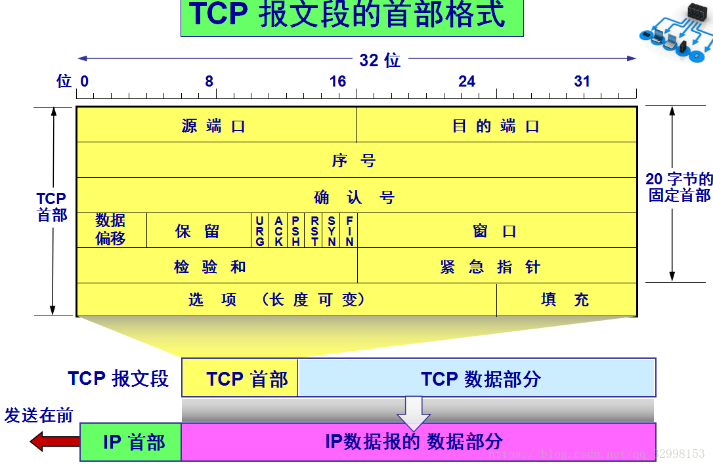
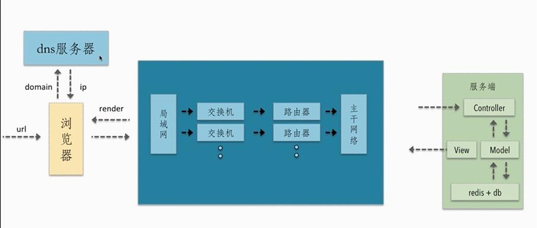

计算机网络基础

# TCP

TCP是在不可靠的IP层上实现的可靠的数据传输协议，它主要解决传输的**可靠、有序、无丢失和不重复问题**。

1. TCP是**面向链接**的**传输层**协议。
2. 每一条TCP连接只能有2个端点。
3. 全双工
4. 面向字节流

1. **序号：**TCP是面向字节流的，传输时是按照字节一个个字节来传输的，所以需要带编号。这个字段的意思是——本报文段所发送的数据的第一个字节的序号。
2. **确认号**：期望收到对方的**下一个报文段的数据的第一个字节**的序号。
3. **确认位（ACK）**：只有当`ACK = 1 `时，确认号字段才有效。TCP规定，在连接建立后所有传送的报文段都必须把ACK置为1。
4. **同步位（SYN）**；`SYN = 1` 时表明这是一个连接请求或者连接接受报文。
   - 当`SYN = 1， ACK = 0` 时表明这是一个连接请求报文。
   - 当`SYN = 1， ACK = 1` 时表明这是一个连接接受报文。
5. **终止位（FIN）**：用来释放一个连接。`FIN = 1` 表明此报文段的发送方的数据已发送完毕，并要求释放传输连接。

## 三次握手

1. 第一次握手：Client将标志位SYN置为1，随机产生一个值seq=J，并将该数据包发送给Server，Client进入**SYN_SENT**状态，等待Server确认。（连接请求不携带数据，但要消耗掉一个序号）。
2. 第二次握手：Server收到数据包后由标志位SYN=1知道Client请求建立连接，Server将标志位SYN和ACK都置为1，ack=J+1，随机产生一个值seq=K，并将该数据包发送给Client以确认连接请求，Server进入**SYN_RCVD**状态。（**这时server为该TCP连接分配TCP缓存和变量**，确认报文也不携带数据，但要消耗掉一个序号）。
3. 第三次握手：Client收到确认后，检查ack是否为J+1，ACK是否为1，如果正确则将标志位ACK置为1，序号字段为j + 1 ，确认号字段为 ack=K+1，并将该数据包发送给Server，Server检查ack是否为K+1，ACK是否为1，如果正确则连接建立成功，Client和Server进入**ESTABLISHED**状态，完成三次握手，随后Client与Server之间可以开始传输数据了。（这时client为该TCP连接分配TCP缓存和变量）

## 四次挥手

1. 第一次挥手：Client发送一个FIN，用来关闭Client到Server的数据传送，Client进入FIN_WAIT_1状态。
2. 第二次挥手：Server收到FIN后，发送一个ACK给Client，确认序号为收到序号+1（与SYN相同，一个FIN占用一个序号），Server进入CLOSE_WAIT状态。
3. 第三次挥手：Server发送一个FIN，用来关闭Server到Client的数据传送，Server进入LAST_ACK状态。
4. 第四次挥手：Client收到FIN后，Client进入TIME_WAIT状态，接着发送一个ACK给Server，确认序号为收到序号+1，Server进入CLOSED状态，完成四次挥手。

## TCP 协议如何保证可靠传输

TCP使用了校验、序号、确认和重传等机制来达到这个目的。

1. **序号：**TCP 给发送的每一个包进行编号，接收方对数据包进行排序，把有序数据传送给应用层。 

2. **确认：**TCP默认使用累计确认，即TCP只确认数据流中至第一个丢失字节为止的字节。

3. **校验和：** TCP 将保持它首部和数据的检验和。这是一个端到端的检验和，目的是检测数据在传输过程中的任何变化。如果收到段的检验和有差错，TCP 将丢弃这个报文段和不确认收到此报文段。 

4. **重传：**超时和冗余ACK都会导致重传。

   - **自动重传请求 ARQ 协议**

     停止等待协议中超时重传是指只要超过一段时间仍然没有收到确认，就重传前面发送过的分组（认为刚才发送过的分组丢失了）。因此每发送完一个分组需要设置一个超时计时器，其重转时间应比数据在分组传输的平均往返时间更长一些。这种自动重传方式常称为自动重传请求ARQ。

     **优点：** 简单

     **缺点：** 信道利用率低

   - **连续ARQ协议**

     连续 ARQ 协议可提高信道利用率。发送方维持一个发送窗口，凡位于发送窗口内的分组可以连续发送出去，而不需要等待对方确认。接收方一般采用累计确认，对按序到达的最后一个分组发送确认，表明到这个分组为止的所有分组都已经正确收到了。

     **优点：** 信道利用率高，容易实现，即使确认丢失，也不必重传。

     **缺点：** 不能向发送方反映出接收方已经正确收到的所有分组的信息。 比如：发送方发送了 5条 消息，中间第三条丢失（3号），这时接收方只能对前两个发送确认。发送方无法知道后三个分组的下落，而只好把后三个全部重传一次。这也叫 Go-Back-N（回退 N），表示需要退回来重传已经发送过的 N 个消息。

### TCP流量控制

1. 目的是消除发送方使接收方缓存区溢出，因此可以说流量控制是一个速度匹配服务。
2. TCP使用滑动窗口机制来实现流量控制。

### TCP拥塞控制

1. 目的是防止过多的数据注入网络中，这样可以使网络中的路由器或者链路不致过载。
2. 四种算法：慢开始、拥塞避免、快重传、快恢复。

   - **慢开始：** 慢开始算法的思路是当主机开始发送数据时，如果立即把大量数据字节注入到网络，那么可能会引起网络阻塞，因为现在还不知道网络的符合情况。经验表明，较好的方法是先探测一下，即由小到大逐渐增大发送窗口，也就是由小到大逐渐增大拥塞窗口数值。cwnd初始值为1，每经过一个传播轮次，cwnd加倍。
   - **拥塞避免：** 拥塞避免算法的思路是让拥塞窗口cwnd缓慢增大，即每经过一个往返时间RTT就把发送放的cwnd加1.
   - **快重传与快恢复：**
     在 TCP/IP 中，快速重传和恢复（fast retransmit and recovery，FRR）是一种拥塞控制算法，它能快速恢复丢失的数据包。没有 FRR，如果数据包丢失了，TCP 将会使用定时器来要求传输暂停。在暂停的这段时间内，没有新的或复制的数据包被发送。有了 FRR，如果接收机接收到一个不按顺序的数据段，它会立即给发送机发送一个重复确认。如果发送机接收到三个重复确认，它会假定确认件指出的数据段丢失了，并立即重传这些丢失的数据段。有了 FRR，就不会因为重传时要求的暂停被耽误。 　当有单独的数据包丢失时，快速重传和恢复（FRR）能最有效地工作。当有多个数据信息包在某一段很短的时间内丢失时，它则不能很有效地工作。

# UDP

# HTTP & HTTPS

# 请求会发生什么

1. 用户输入url，浏览器内部代码将url进行拆分解析
2. 浏览器首先去找本地的hosts文件，检查在该文件中是否有相应的域名、IP对应关系，如果有，则向其IP地址发送请求，如果没有就会将domain（域）发送给 dns进行解析，将域名解析成对应的服务器IP地址，发回给浏览器。
3. 浏览器拿到了服务器IP，接下来是网络通信，分层由高到低分别为：应用层、传输层、网络层、数据链路层。发送端从应用层往下走，接收端从数据链路层往上
4. 页面的渲染阶段
   1. 解析HTML生成DOM树。
   2. 解析CSS生成CSSOM规则树。
   3. 将DOM树与CSSOM规则树合并在一起生成渲染树。
   4. 遍历渲染树开始布局，计算每个节点的位置大小信息。
   5. 将渲染树每个节点绘制到屏幕。

[浏览器的一个请求从发送到返回都经历了什么？](https://www.cnblogs.com/echo-hui/p/9298203.html)

# 面试题

> ### TCP连接阶段

- ### 发送序号和确认序号问题

  例： TCP建立连接的过程采用三次握手，已知第三次握手报文的发送序列号为1000，确认序列号为2000，请问第二次握手报文的发送序列号和确认序列号分别为？
  答：看答案时请参考上面TCP连接建立的图。
  客户端：发送X
  服务端：发送Y， 确认X+1
  客户端：发送X+1（1000），确认Y+1（2000）
  可以反推第二次为1999,确认1000

- ### 为什么TCP建立连接要三次握手

  1. 首先得回答三次握手的目的是**同步连接双方的序列号**和**确认号**并**交换 TCP 窗口大小信息**。
  2. 回答为什么两次握手不行，C发送请求，S应答并分配资源，若S的应答没有到达C端，C认为连接未建立，而S认为建立了，S会在一段时间内保留分配的资源，如果大量C这样请求，S会崩溃 。
  3. 最后回答握手当然可以四次五次一直握下去，但三次已经够了，就没有必要了。总结下来一句话，主要目的防止在网络发生延迟或者丢包的情况下浪费资源。

- ### 为什么断开TCP连接需要进行四次握手 

  因为TCP连接是**全双工的网络协议**，允许同时通信的双方同时进行数据的收发，同样也允许收发两个方向的连接被独立关闭，以避免client数据发送完毕，向server发送FIN关闭连接，而server还有发送到client的数据没有发送完毕的情况。所以关闭TCP连接需要进行四次握手，每次关闭一个方向上的连接需要FIN和ACK两次握手。

-  ### tcp怎么保证有序传输的

  1. 主机每次发送数据时，TCP就给每个数据包分配一个序列号并且在一个特定的时间内等待接收主机对分配的这个序列号进行确认。
  2. 如果发送主机在一个特定时间内没有收到接收主机的确认，则发送主机会重传此数据包。接收主机利用序**列号**对接收的数据进行确认，以便检测对方发送的数据是否有丢失或者乱序等。
  3. 接收主机一旦收到已经顺序化的数据，它就将这些数据按正确的顺序重组成数据流并传递到高层进行处理。

- ### 讲下tcp的快速重传和拥塞机制，

- ### 知不知道time_wait状态，这个状态出现在什么地方，有什么用？（参考quic）

  - 通信双方建立TCP连接后，主动关闭连接的一方就会进入TIME_WAIT状态。客户端主动关闭连接时，会发送最后一个ack后，然后会进入TIME_WAIT状态，再停留2个MSL时间(后有MSL的解释)，进入CLOSED状态。

  - TCP/IP协议就是这样设计的，是不可避免的。主要有两个原因:

    - 可靠地实现TCP全双工连接的终止

      TCP协议在关闭连接的四次握手过程中，最终的ACK是由主动关闭连接的一端（后面统称A端）发出的，如果这个ACK丢失，对方（后面统称B端）将重发出最终的FIN，因此A端必须维护状态信息（TIME_WAIT）允许它重发最终的ACK。如果A端不维持TIME_WAIT状态，而是处于CLOSED  状态，那么A端将响应RST分节，B端收到后将此分节解释成一个错误（在java中会抛出connection  reset的SocketException)。

      因而，要实现TCP全双工连接的正常终止，必须处理终止过程中四个分节任何一个分节的丢失情况，主动关闭连接的A端必须维持TIME_WAIT状态 。

     

    - 允许老的重复分节在网络中消逝 

      TCP分节可能由于路由器异常而“迷途”，在迷途期间，TCP发送端可能因确认超时而重发这个分节，迷途的分节在路由器修复后也会被送到最终目的地，这个迟到的迷途分节到达时可能会引起问题。在关闭“前一个连接”之后，马上又重新建立起一个相同的IP和端口之间的“新连接”，“前一个连接”的迷途重复分组在“前一个连接”终止后到达，而被“新连接”收到了。为了避免这个情况，TCP协议不允许处于TIME_WAIT状态的连接启动一个新的可用连接，因为TIME_WAIT状态持续2MSL，就可以保证当成功建立一个新TCP连接的时候，来自旧连接重复分组已经在网络中消逝。

- ### 知道udp是不可靠的传输，如果你来设计一个基于udp差不多可靠的算法，怎么设计？

- ### http与https有啥区别？说下https解决了什么问题，怎么解决的？说下https的握手过程。

  - HTTP：是互联网上应用最为广泛的一种网络协议，是一个客户端和服务器端请求和应答的标准（TCP），用于从WWW服务器传输超文本到本地浏览器的传输协议，它可以使浏览器更加高效，使网络传输减少。
  - HTTPS：是以安全为目标的HTTP通道，简单讲是HTTP的安全版，即HTTP下加入SSL层（Secure Sockets Layer 安全套接层），HTTPS的安全基础是SSL，因此加密的详细内容就需要SSL。

  　　HTTPS协议的主要作用可以分为两种：一种是建立一个信息安全通道，来保证数据传输的安全；另一种就是确认网站的真实性。

[TCP为什么要三次握手，不是两次四次？](http://blog.chinaunix.net/uid-20726927-id-2455485.html)

[为什么建立TCP连接需要三次握手，为什么断开TCP连接需要四次握手，TIME_WAIT状态的意义](https://www.cnblogs.com/zhoudayang/p/6012257.html)

[tcp窗口滑动以及拥塞控制](https://www.cnblogs.com/woaiyy/p/3554182.html)

> #### http 响应码 301 和 302 代表的是什么？有什么区别？

301 redirect: 301 代表永久性转移(Permanently Moved)。
302 redirect: 302 代表暂时性转移(Temporarily Moved )。 

[HTTP返回码中301与302的区别](https://blog.csdn.net/qmhball/article/details/7838989)

> #### 如何实现跨域？

> #### 说一下 JSONP 实现原理？