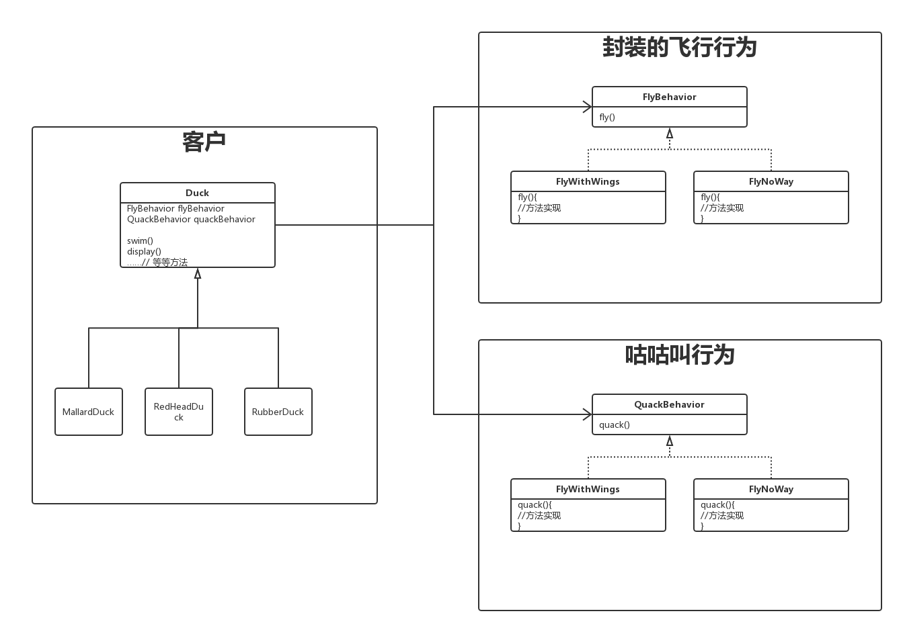

# 综述

三年以上工作经历，常见的设计模式（多说设计模式种类） 最好能说出JDK，Spring、 Tomcat中底层的一些实现用到哪些设计模式

内容基本都是选自《Head First 设计模式》


# 策略模式

定义了算法族，分别封装起来，让他们之间可以相互替换，此模式让算法的变化独立与使用算法的客户。


>  ## 设计原则

**多用组合，少用继承**



- 在Duck类中，有2个成员变量是接口，在duck类的成员方法中调用这两个接口的方法。
- Duck应该写成一个抽象类会比较好，那2个接口的变量值的注入由子类来实现。
- 这样由于接口的不同实现类，所以调用了同一个方法的不同实现，完全不需要改Duck类代码。
- 需要新增的话也非常简单，由于两边完全解耦，所以代码也可以被其他模块复用。


# 观察者模式

定义了对象之间的一对多依赖，这样一来，当一个对象改变状态时，她的所有依赖者都会收到通知并自动更新。


- 简单来说就是被观察的类里面存一个List<interface>
- 所有的的观察者需要实现这个接口
- 观察着把自己放进被观察者的List里面
- 被观察者的某些方法执行之后，把这个list遍历一遍，调用接口的方法传递消息


> ## JDK

- 在JDK中有一个默认实现在`java.util`包下，但是在jdk9的时候已被废弃。
- 在Swing，java的图形界面中也用了这个模式，按钮之类的。


# 装饰者模式

动态地将责任附加到对象上。若要扩展功能，装饰者提供了比继承更有弹性的替代方案。


> ## 设计原则

**开闭原则—对扩展开放，对修改关闭**


最简单的例子，充分利用多态，用父类对象来接收子类。

```java
public father{
   ……
}

//son1,son2...都是一样的
public class son1 extends father{
    Father father;
    public son1(Father father){
        this.father = father;
    }
}

Father father = new Father();
Father son1 = new Son1();
son1 = new Son2(son1);
son1 = new Son3(son1);
```


> ## JDK

- java I/O。最里面是一个`InputStream`，提供最基本的输入流。
- 封装第一层，`FileInputStram`文件的输入流等等


# 工厂模式


> ## 简单工厂

这并不是一个真正的模式，他仅仅是把创建部分的代码单独提取出来，放到一个新方法中。


> ## 工厂方法模式

定义了一个创建对象的接口，但由子类决定要实例化的类是哪一个。工厂方法让类把实例化推迟到子类。


> ## 抽象工厂模式

提供一个接口，用于创建相关或依赖对象的家族，而不需要明确指定具体类。


**抽象工厂模式与工厂方法模式的区别**

　　抽象工厂模式是工厂方法模式的升级版，它用来创建一组相关或者相互依赖的对象。

　　它与工厂方法模式的区别在于：工厂方法模式针对的是一个产品等级结构，而抽象工厂模式则是针对的多个产品等级结构。在编程中，通常一个产品等级结构，表现为一个接口或抽象类，也就是说，工厂方法模式提供的所有产品都是衍生自同一个接口或抽象类，而抽象工厂模式所提供的产品则是衍生自不同的接口或抽象类，如上图中的ProductA和ProductB。

　　在抽象工厂模式中，有一个产品族的概念，所谓产品族，是指位于不同产品等级结构中功能相关联的产品组成的家族。抽象工厂模式所提供的一系列产品就组成了一个产品族；而工厂方法提供的一系列产品称为一个等级结构。如上图中的ProductA和ProductB称为两个不同的等级结构，ProductA1和ProductA2属于同一个等级结构，ProductB1和ProductB2属于另一个等级结构，而ProductA1和ProductB1属于同一个产品族，ProductA1和ProductB1同属于一个产品族。

　　如果产品全部属于同一个等级结构（即同一个接口或抽象类），则属于工厂方法模式；如果产品来自多个等级结构（即多个不同的接口或抽象类），则属于抽象工厂模式。


> ## 设计原则

**依赖倒置**—要依赖抽象，不要依赖具体具体类。

不能让高层组件依赖底层组件，而且，不管高层或底层组件，“两者”都应该依赖于抽象。


# 单例模式

确保一个类只有一个实例，并提供一个全局访问点。


方1：

```java
public class Singleton {
    private static Singleton uniqueInstance;
    
    public static Singleton getInstance（）{
        if(uniqueInstance == null){
            uniqueInstance = new Singleton();
        }
        
        return uniqueInstance;
    }
}
```

明显，多线程运行时会有问题。


方2：

```java
public class Singleton {
    private static Singleton uniqueInstance;
    
    public static synchronized Singleton getInstance（）{
        if(uniqueInstance == null){
            uniqueInstance = new Singleton();
        }
        
        return uniqueInstance;
    }
}
```

问题两点：

1. 整个方法加了同步，降低性能。
2. 只有第一次new的时候，同步才是有意义的，后续直接取值其实是直接取现有的，是不需要同步的，白白浪费时间。


方3：使用急切模式

```java
public class Singleton {
    private static Singleton uniqueInstance = new Singleton();
    
    public static synchronized Singleton getInstance（）{
        return uniqueInstance;
    }
}
```


方4：双重检查加锁

```java
public class Singleton {
    private static Singleton uniqueInstance;
    
    public static Singleton getInstance（）{
        if(uniqueInstance == null){
            synchronized(Singleton.class){
                if(uniqueInstance == null){
                        uniqueInstance = new Singleton();
                }
            }
        }
        
        return uniqueInstance;
    }
}
```


# 命令模式

Hystrix 

通过HystrixCommand 或者HystrixObservableCommand 将所有的外部系统（或者称为依赖）包装起来，整个包装对象是单独运行在一个线程之中（这是典型的命令模式）。


# 适配器模式

# 模板方法模式

# 状态模式

# 代理模式 


# Spring中用了哪些设计模式？                                                                                  

1. 简单工厂模式

2. 工厂方法模式

3. 单例模式

4. 适配器模式

5. 包装器模式

6. 代理模式

7. 观察者模式

   定义对象间的一种一对多的依赖关系，当一个对象的状态发生改变时，所有依赖于它的对象都得到通知并被自动更新。
   spring中Observer模式常用的地方是listener的实现。如ApplicationListener。 

   

8. 策略模式

9. 模板方法模式

   JdbcTemplate

   

   [面试官：Spring中用了哪些设计模式？](https://mp.weixin.qq.com/s/iGbwKDqB6A0ktNCY8Wd-XQ)

   

